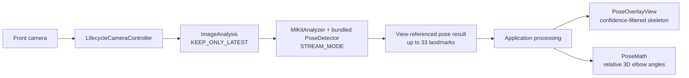

# Android Human Pose Estimation

An Android application that estimates a person’s pose from the front camera, draws a
confidence-filtered skeleton over the preview, and displays left and right elbow angles.
Camera frames are processed locally through CameraX and ML Kit’s bundled pose detector; the
application requests no network permission and does not store images.

This repository implements the Android camera and lifecycle integration, preview-aligned
rendering, confidence handling, UI states, and joint-angle geometry. The underlying pose model
is provided by Google ML Kit and was not trained by the repository author.

[](https://github.com/KouroshEsmaeili/android-pose-estimation/actions/workflows/android.yml)
[](https://android-arsenal.com/api?level=24)
[](LICENSE)

## Processing pipeline



`LifecycleCameraController` owns lifecycle-aware capture and preview. `MlKitAnalyzer` passes
frames to the bundled detector and requests `PreviewView` coordinates from CameraX, so the
custom overlay does not need rotation, front-camera mirroring, or scaling constants.

## Key features

- Lifecycle-aware front-camera preview and image analysis with latest-frame backpressure
- Bundled ML Kit pose inference in stream mode, with no model download at runtime
- CameraX view-coordinate integration for preview-aligned landmark rendering
- In-frame likelihood filtering for skeleton segments, joints, and angle labels
- Relative 3D elbow-angle calculation with degenerate and non-finite input handling
- Clear permission, unavailable-camera, initialization, and inference-error states
- Local processing with no image storage and no network permission
- Unit tests, Android lint, debug packaging, and minified release packaging in CI

## Architecture

| Layer | Responsibility |
| --- | --- |
| `MainActivity` | Owns camera permission state, the CameraX controller, detector, analysis executor, lifecycle binding, error states, and teardown. |
| ML Kit `PoseDetector` | Supplies the bundled third-party model and returns a pose containing up to 33 landmarks. |
| `PoseOverlayView` | Filters low-confidence landmarks and draws the body skeleton and elbow labels in preview coordinates. |
| `PoseMath` | Computes angles from relative 3D landmark coordinates as a pure Java geometry utility. |

## Technical details

| Component | Version or setting |
| --- | --- |
| Language | Java 17 |
| Minimum Android version | API 24 |
| Compile / target SDK | 36 / 36 |
| Android Gradle Plugin | 8.13.2 |
| Gradle wrapper | 8.13 |
| CameraX | 1.5.3 |
| ML Kit Pose Detection | 18.0.0-beta5 |

ML Kit Pose Detection remains a beta API. The application uses its base bundled SDK rather than
the accurate variant or a remotely downloaded model.

## Build and run

Requirements:

- JDK 17
- Android SDK 36 and Build Tools 36.0.0
- Android Studio compatible with Android Gradle Plugin 8.13
- An Android device running API 24 or newer with a front-facing camera

Clone and open the repository in Android Studio:

```bash
git clone https://github.com/KouroshEsmaeili/android-pose-estimation.git
cd android-pose-estimation
```

Allow Gradle sync to finish, connect a device, run the `app` configuration, and grant
camera permission. A physical device is recommended because an emulator may not provide
representative camera input.

Run the complete local verification suite on macOS or Linux:

```bash
./gradlew clean testDebugUnitTest lintDebug assembleDebug assembleRelease
```

On Windows:

```powershell
.\gradlew.bat clean testDebugUnitTest lintDebug assembleDebug assembleRelease
```

## Validation

### Automated validation

GitHub Actions validates the Gradle wrapper, configures JDK 17, and runs the unit tests, Android
lint, debug build, and minified/resource-shrunk release build. The unit tests cover right,
straight, and depth-axis angles along with zero-length, non-finite, and large-coordinate cases.

### Physical-device validation

The project owner has run the application successfully on a physical Android phone and observed
the application launch, front-camera pose estimation, and overlay functionality working. This
was a focused functional check on one device, not a broad compatibility, orientation, or
performance test.

## Privacy

- Camera access is the only runtime permission.
- The pose model is bundled with the application and inference occurs on the device.
- Frames and pose results remain in memory and are not written to storage.
- The merged application manifest contains neither `INTERNET` nor `ACCESS_NETWORK_STATE`.
- Android application backup and device-transfer extraction are disabled.

These statements describe the repository’s implementation; they are not a general privacy or
security certification.

## Limitations

- ML Kit tracks the most prominent person; this application does not support multi-person poses.
- The application requires a front-facing camera.
- Only major body landmarks are rendered, although the detector can return 33 landmarks.
- Landmark Z values represent relative image-space depth, not metric 3D reconstruction, and are
  less reliable than X/Y coordinates.
- Elbow angles inherit uncertainty from landmark visibility and pose-estimation quality.
- ML Kit Pose Detection is a beta dependency and may introduce breaking changes.
- No accuracy, robustness, latency, frame-rate, battery, or broad device-compatibility claims are
  made.
- Pose classification and activity recognition are outside the project’s scope.

## Project structure

```text
app/src/main/java/io/github/kouroshesmaeili/poseestimation/
├── MainActivity.java       # Camera permission, lifecycle, analysis, and teardown
├── PoseOverlayView.java    # Confidence filtering and preview rendering
└── PoseMath.java           # Pure relative-3D angle geometry

app/src/test/
└── PoseMathTest.java       # Geometry and numerical edge cases
```

## License

Licensed under the [Apache License 2.0](LICENSE).
